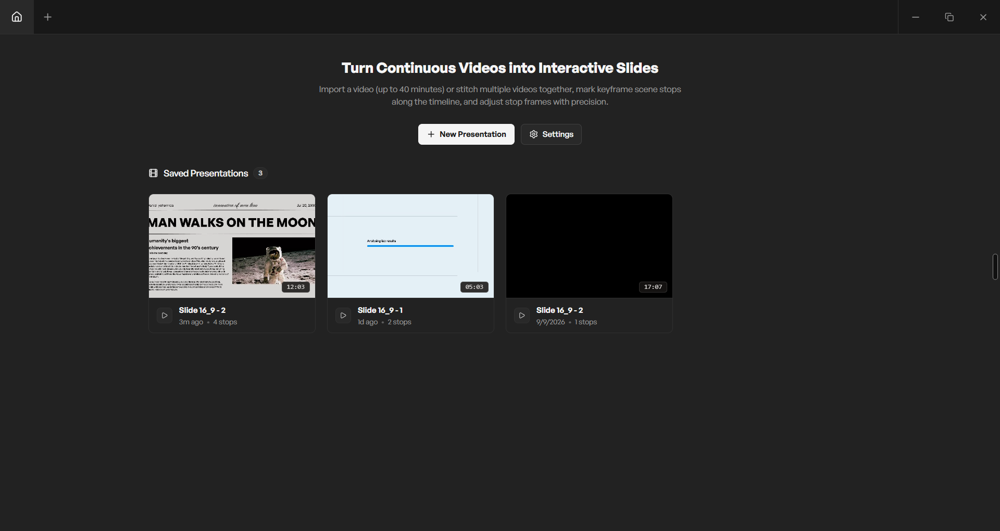
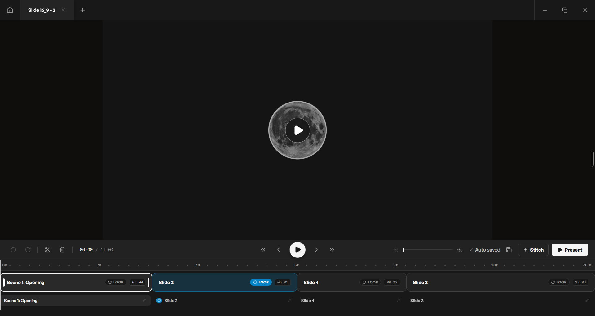
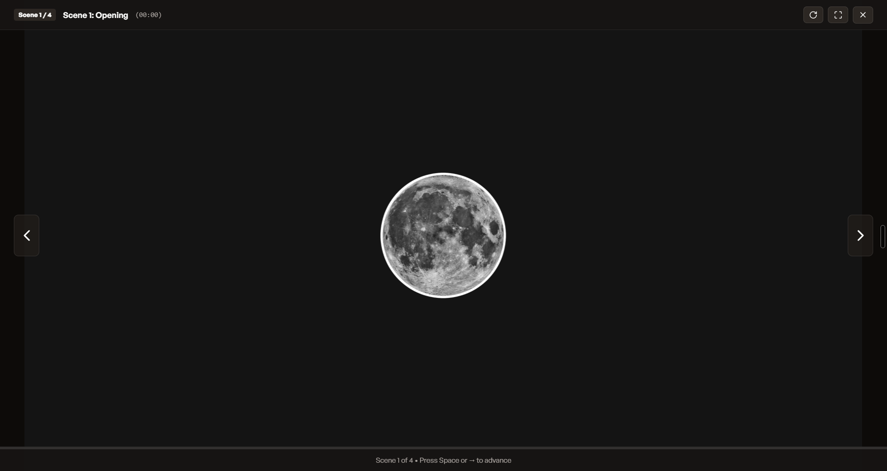

# V2S — Video to Slide

desktop and web application for turning continuous video presentations into interactive, auto-pausing slide decks.


## Why This Exists

Presenting screen recordings, UI prototypes, motion graphics, or video demos is often frustrating. Speakers are usually left with two flawed options: either export static screenshots into slide software (sacrificing fluid animations and transitions) or play a raw video file and struggle to manually pause at exact split-seconds while talking to an audience.

**V2S** bridges this gap. It turns any continuous video recording or stitched set of clips into a slide-like presentation. By setting keyframe scene stops along a precision timeline, you can present using familiar slide controls (`Space` or `→`). The video plays smoothly between scenes and automatically halts—or seamlessly loops—at each designated stop frame, giving you animated, interactive presentations with zero manual scrubbing.





## Features

- **Continuous Video Timeline**: Mark exact keyframe stop points along the video where playback should automatically pause.
- **Looping Scene Strips**: Set specific scenes to loop continuously (perfect for explaining rotating 3D models, UI micro-interactions, or animated diagrams).
- **Multi-Video Stitching**: Import and concatenate multiple video clips (up to 40 minutes total) into a single continuous presentation.
- **Sub-Second Precision Scrubbing**: Frame-by-frame nudge controls (`-1s`, `-1 frame`, `+1 frame`, `+1s`) with zoomable timeline ruler.
- **Multi-Tab Workspace**: Work on multiple presentations simultaneously in browser-style tabs.
- **Local & Offline-First**: All presentations, scene configurations, and thumbnails are stored locally in your browser's IndexedDB—no cloud backend or internet required.
- **Automatic Background Saving**: Configurable auto-save intervals with unobtrusive save status indicators.
- **Customizable Preferences**: Tailor transition speed (0.5x to 2x), auto-save intervals, default scene prefixes, and dark/light themes.

## Getting Started

### Prerequisites

- [Node.js](https://nodejs.org/) (version 18 or higher)
- [pnpm](https://pnpm.io/) (recommended), npm, or bun

### Installation

```bash
git clone https://github.com/94YDanielY94/V2S.git
cd V2S
pnpm install
```

### Running in Development

**Desktop App (Electron + Vite):**
```bash
pnpm dev
```

**Browser Only (Web Mode):**
```bash
pnpm dev:web
```

Open the app at [http://localhost:5173](http://localhost:5173).

### Production Build

```bash
pnpm build
pnpm start
```

## How It Works

1. **Import Video**: Click `+ New Presentation` on the dashboard to import a video file (`.mp4`, `.webm`, `.mov`, etc.). Add more clips at any time using the `+ Stitch` button.
2. **Set Scene Stops**: Scrub through your video to transition moments and click `+ Add Stop` (or press `K`) to create keyframe scene stops.
3. **Configure Scenes**: Label your scenes, drag handles to adjust stop timestamps, or enable `LOOP` for continuous animations.
4. **Present**: Click `Present` (or press `F5`) to enter fullscreen presentation mode. Use `Space` or `→` to advance—the video plays naturally to the next scene and pauses automatically.
5. **Manage & Auto-Save**: Your presentations are automatically persisted to IndexedDB so you can reopen, edit, or delete them whenever you return.

All video data and settings remain entirely on your local machine. Nothing is sent to external servers.

## Keyboard Shortcuts

### Presentation Mode

| Key | Action |
| --- | --- |
| `Space` | Advance to next scene / Play or pause video transition |
| `→` / `PageDown` | Advance to next scene stop |
| `←` / `Backspace` / `PageUp` | Return to previous scene stop |
| `L` | Toggle looping for the current scene |
| `F` | Toggle fullscreen mode |
| `Esc` | Exit fullscreen / Close presentation mode |

### Editor & Workspace

| Key | Action |
| --- | --- |
| `K` | Add scene stop at current timestamp |
| `Ctrl` + `,` | Open Settings & Preferences |
| `Esc` | Close active modal or overlay |

## License

[MIT](LICENSE)

See [CONTRIBUTING.md](CONTRIBUTING.md) for development setup and contribution guidelines, and [CHANGELOG.md](CHANGELOG.md) for release history.
